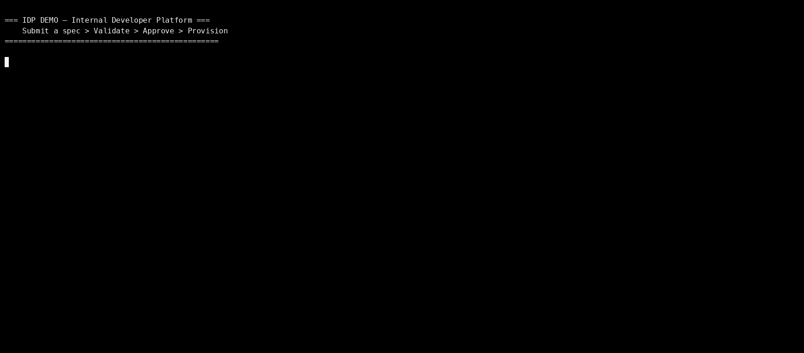

# IDP Mock — Internal Developer Platform

> A working example of how Platform Engineering teams let developers request
> infrastructure through a spec, review it for security, and provision it
> automatically — whether on-prem, cloud, or hybrid.



---

## What Is This?

This is a mock Internal Developer Platform (IDP). It shows the full process:

1. Engineer fills in a YAML form saying what they need
2. Platform validates it — checks nothing is missing or misconfigured
3. Security review runs — blocks anything dangerous
4. Provisioner creates the infra — security group, load balancer, target group, compute service
5. Engineer gets their endpoint — service is live

The infrastructure is simulated (no real AWS calls), but the logic and workflow are production-realistic.

---

## Why This Matters

An IDP solves three problems that financial institutions face:

**Resilience** — Every service gets at least 2 replicas across availability zones.
If one fails, the load balancer routes traffic to healthy instances automatically.

**Scalability** — Auto-scaling is built into every deployment. The platform handles
scaling from min to max replicas based on load without engineer intervention.

**Disaster Recovery** — The standard architecture uses:
- Multi-AZ deployments (survive a data centre failure)
- Health checks with automatic replacement of failed tasks
- Infrastructure-as-code so any environment can be rebuilt from the spec
- State stored externally (not on compute) so tasks are disposable

**On-Prem vs Cloud** — The same spec-driven workflow works regardless of target:
- Cloud: provisions into AWS (ECS, ALB, CloudWatch)
- On-Prem: provisions into Kubernetes, HAProxy, Prometheus (same pattern, different provisioner)
- Hybrid: gateway in cloud, compute on-prem (or vice versa)

---

## Quick Start

```bash
pip install -r requirements.txt

# Run the full demo
./demo.sh

# Or step by step:
python platform_cli.py submit --spec examples/trade-service.yaml
python provisioner.py --request-id <REQUEST_ID>

# Run tests
python -m pytest tests/ -v
```

---

## Project Layout

```
├── platform_cli.py          # What engineers use to submit requests
├── provisioner.py           # What creates the infrastructure after approval
├── validator.py             # Rules that check if the spec is valid and secure
├── models.py                # Data structures (request, infra state)
├── store.py                 # Saves request/infra state as JSON files
├── demo.sh                  # Script to run the full demo (for GIF recording)
├── examples/                # Sample request specs
│   └── trade-service.yaml
├── tests/                   # Automated tests
│   └── test_e2e.py
├── docs/                    # Architecture diagrams and docs
│   └── e2e-architecture.md
├── requests/                # (created at runtime) submitted requests
└── infrastructure/          # (created at runtime) provisioned infra state
```

---

## How to Record the Demo GIF

```bash
# Option 1: asciinema + agg
asciinema rec demo.cast
./demo.sh
# press Ctrl+D to stop
agg demo.cast docs/demo.gif

# Option 2: terminalizer
terminalizer record demo
# run ./demo.sh inside the recording
terminalizer render demo -o docs/demo.gif
```

---

## Environment Placeholders

This mock uses placeholder values. In a real setup, replace these:

| Placeholder | Real Value |
|-------------|-----------|
| `<YOUR_VPC_ID>` | Your actual VPC ID |
| `<ACCOUNT_ID>` | Your AWS account ID |
| `<REGION>` | Your AWS region |
| `<SERVICE_NAME>` | Your ECR image name |
| JSON file store | DynamoDB, PostgreSQL, or your DB of choice |
| `platform_cli.py` | Web portal (Backstage, Port) or API |
| `provisioner.py` | Terraform, CDK, Crossplane, or Ansible (on-prem) |

---

## How PaaS Handles Resilience and Disaster Recovery

```
                      REGION (e.g. af-south-1)
 ┌──────────────────────────────────────────────────────────┐
 │                                                          │
 │   AZ-a                         AZ-b                      │
 │  ┌────────────────┐           ┌────────────────┐         │
 │  │  Subnet        │           │  Subnet        │         │
 │  │  ┌──────────┐  │           │  ┌──────────┐  │         │
 │  │  │  Task 1  │  │           │  │  Task 2  │  │         │
 │  │  └──────────┘  │           │  └──────────┘  │         │
 │  └────────────────┘           └────────────────┘         │
 │           │                           │                  │
 │           └─────────┬─────────────────┘                  │
 │                     │                                    │
 │              ┌──────┴───────┐                            │
 │              │ Load Balancer│ ← health checks            │
 │              │ + WAF        │ ← auto-failover            │
 │              └──────────────┘                            │
 └──────────────────────────────────────────────────────────┘

 If Task 1 dies → LB stops sending traffic to it
                → Auto-scaling launches replacement
                → Zero downtime

 If AZ-a goes down → LB routes all traffic to AZ-b
                   → New tasks launch in AZ-b
                   → Service stays up
```

## On-Prem Equivalent

| Cloud (AWS) | On-Prem Equivalent |
|-------------|-------------------|
| ECS Fargate | Kubernetes pods |
| ALB | HAProxy / Nginx / F5 |
| WAF | ModSecurity / Cloudflare |
| CloudWatch | Prometheus + Grafana |
| Auto Scaling | Kubernetes HPA |
| Multi-AZ | Multiple data centres |
| ECR | Harbor (private registry) |
| Secrets Manager | HashiCorp Vault |

The IDP abstracts this away — engineers submit the same spec regardless of target.
